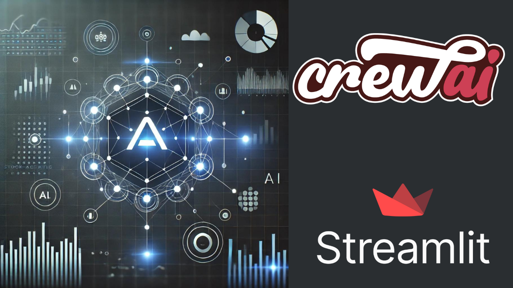
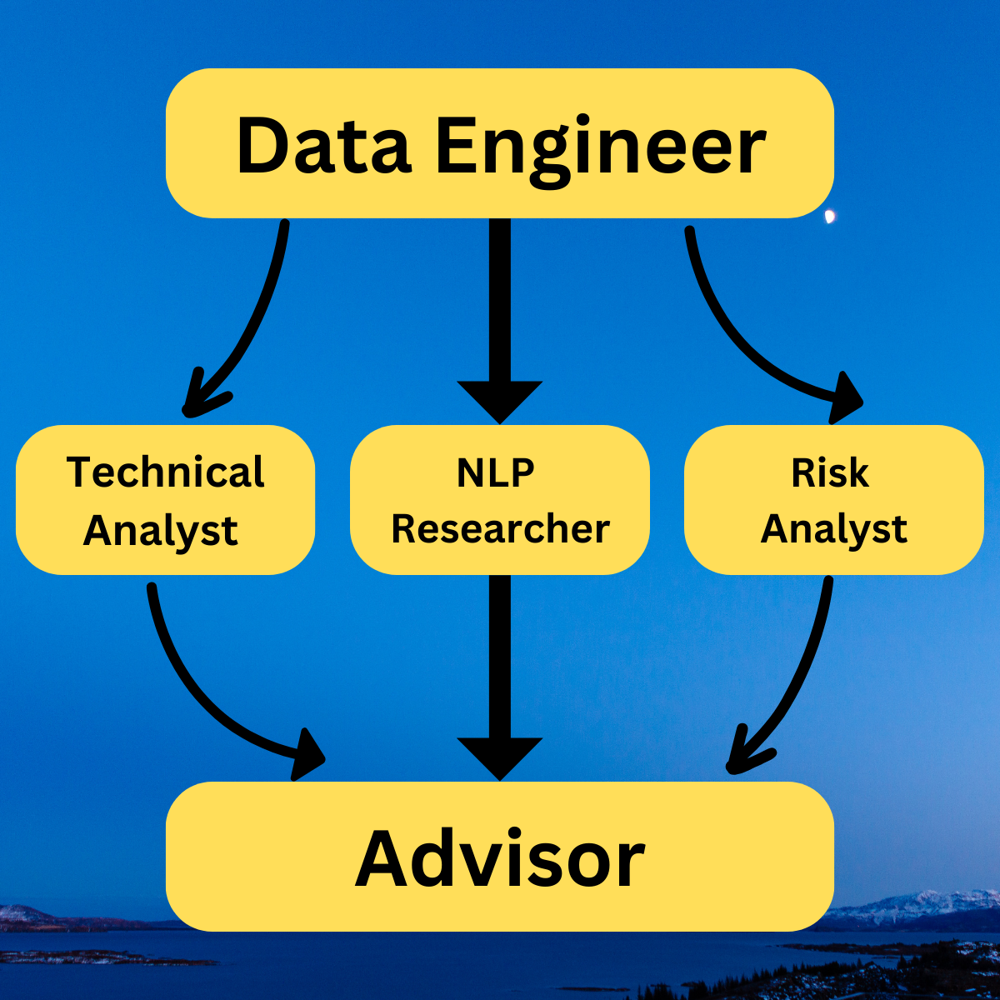
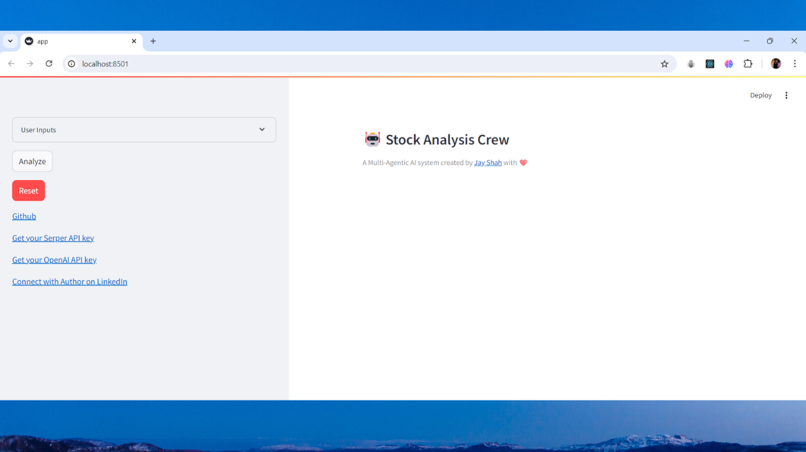
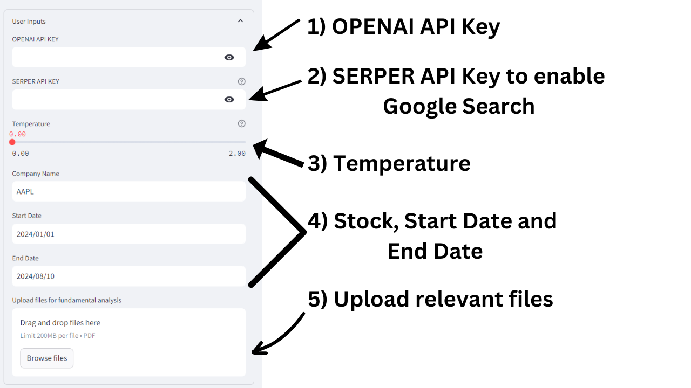

# Stock-Analysis-Crew

This project implements a "Stock Analysis Crew" Multi-Agentic AI system using CrewAI framework. It has a streamlit webapp too that enables a direct interaction with the system.

## Table of Contents

* [Demo](#demo)
* [What are AI Agents?](#what-are-ai-agents)
* [What are Multi-Agentic AI Systems?](#what-are-multi-agentic-ai-systems)
* [Stock Analysis Crew](#stock-analysis-crew)
* [How to replicate?](#how-to-replicate)
* [How to use the Streamlit App?](#how-to-use-the-streamlit-app)
* [References](#references)

## Demo

Click on the above image to view Stock Analysis Crew in action! This demo video will make more sense once you have gone through the following sections, especially "How to use the Stremlit App?".

## What are AI Agents?

AI Agents are autonomous entities based on LLM (Large Language Models) with the goal of solving a particular task. These are rational entities and make decisions based on the available data, provided tools and the context. The tools of an AI Agent may include "Web Search Tool", "Web Scraping Tool", "Docs Search Tool", and so on. These tools help the agent to gather additional knowledge and data when required. Eventually, the goal of the agent is to complete the provided task. 

## What are Multi-Agentic AI Systems?

A Multi-Agentic AI system attempts to mimic a team of humans that come together to complete a particular broad task. Oftentimes, this big task is broken into simpler tasks and these tasks are assigned to different members of the group. For example, consider a typical technical team working on a Software Project. This team may include a front-end developer, backend-developer, UI/UX developer, manager, and so on. Similarly, a multi-agentic AI system can be setup with one agent being a front-end developer, another being a backend-developer, and so on. As per the role, each agent is equipped with the required tools. These agents work in collaboration to complete the task. 

## Stock Analysis Crew

This project implements a "Stock Analysis Crew" Multi-Agentic AI system for the analysis of a stock in a given period. The goal of the crew is to analyze the long term and short term performance performance of the stock in the given period, and also provide insights on a possible future investment. 

As seen in the image, this system has 5 agents (and a manager agent). The 5 agents are Data Engineer, Technical Analyst, NLP Researcher, Risk Analyst and Advisor. The role of each agent in this crew is listed below:

* Data Engineer - The goal of this agent is to validate the user input and download stock prices of the provided company in the given timeframe as a CSV file. The `data.csv` file available in the repository is created by this agent. This allows the user to verify the data from their end that is used by the next agents for various tasks.

* Technical Analyst - The goal of this agent is to do the technical analysis on the `data.csv` file created by the Data Engineer agent. This agent access to the files in the `instructions` folder that has information regarding important technical indicators and the use of `pandas-ta` python framework. This is an attempt to mimic a real world situation where teams would like to provide additional instructions to the agent.

* NLP Researcher - The goals of this agent are fundamental analysis and sentiment analysis based on the the provided documents and recent news about the company, respectively. This agent has access to the folder `inhouse data`. This mimics a real world problem where the team would like to provide in-house data to the agent to improve its performance.

* Risk Analyst - The goal of this agent is to perform risk analysis for the given company for any future investment. It also consider the output given by Technical Analyst Agent and NLP Researcher Agent.

* Advisor - This agent takes into account the outputs generated by Technical Analyst Agent, NLP Researcher Agent, and Risk Analyst Agent to generate a final report on the performance of the stock based on Techincal Analysis, Fundamental Analysis, Sentiment Analysis and Risk Analysis.

## How to replicate? 

The following steps can help you to replicate this project and run the streamlit app. 

1. Clone this repo in a local directory of your choice.

  `git clone https://github.com/Jayshah25/Stock-Analysis-Crew.git`

2. Create a python virtual environment

  `python -m venv venv`

3. Activate the environment (Windows)

  `venv\Scripts\activate`

4. Install the necessary packages

  `pip install -r requirements.txt`

5. After successfull installation, run the following command to launch the streamlit app

  `streamlit run app.py`

## How to use the Streamlit app?

After you have followed the steps described in the previous section, in the case of successful installation, a new window with the web app should pop up and it should look like the image shown below.

It is an easy to use web app where the User Inputs dropdown should be used to provide all the user inputs required for analysis. Once the input is given, press the  `Analyze` button and the results will be displayed in the workspace area. The output shall have two dropdowns - Verbose and Final Result. The Verbose dropdown displays the entire verbose and actions that the system took to reach the final answer. The Final Result shows the final answer. Let's understand the user input dropdown a little more!

1. OPENAI API KEY -> The key is required to run the OPENAI 'gpt-3.5-turbo' and embedding models.

2. SERPER API KEY -> The key is required to access the SERPER API that allows google search. A simple signup on the website will give you free credits.

3. Temperature -> This parameter controls the reproducibility of the OPENAI Model outputs. A lesser value means less randomness in the output and makes output reproducible.

4. User Input -> Provide Stock Name, Start Date and End Date for the analysis.

5. File Upload -> Upload any relevant files that can assist in the analysis. This represents the in-house data that companies have.  

## References

* [CrewAI Documentation](https://docs.crewai.com/)
